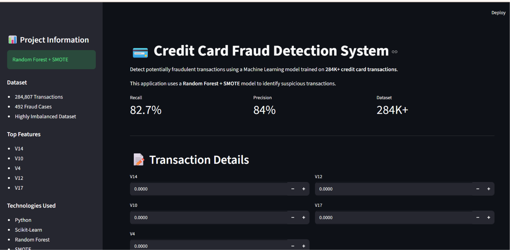
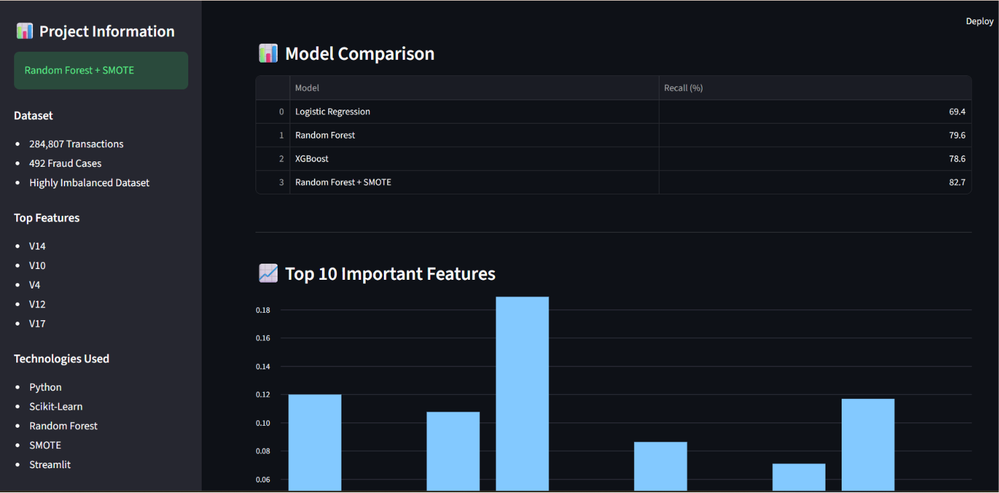
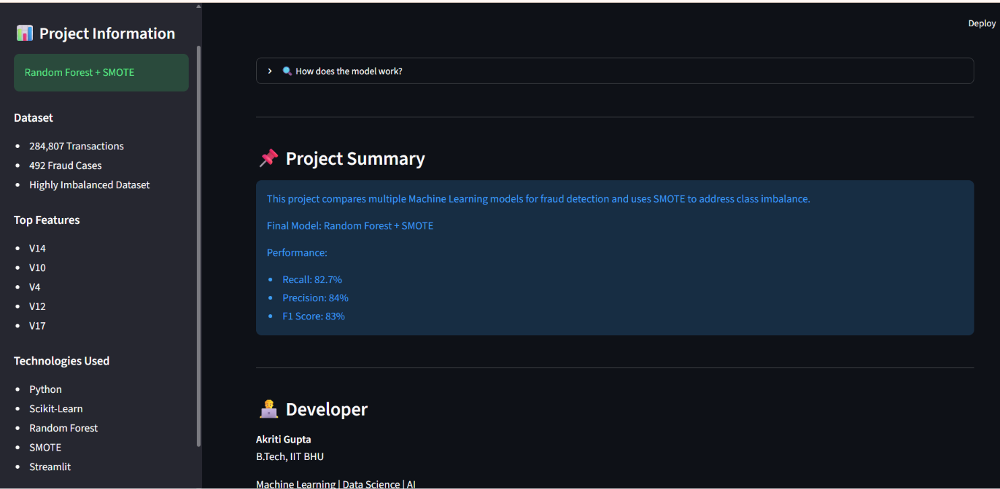

# 💳 Credit Card Fraud Detection System

An end-to-end Machine Learning project for detecting fraudulent credit card transactions using Random Forest, XGBoost, and SMOTE on a highly imbalanced dataset of 284,807 transactions.

---

## 📊 Dataset

- Total Transactions: 284,807
- Fraud Transactions: 492
- Fraud Rate: 0.17%
- Highly Imbalanced Dataset

---
## 🚀 Live Demo

🔗 [Live Demo](https://credit-card-fraud-detection-akriti.streamlit.app/)

## 🚀 Dashboard Preview

### Home Dashboard



### Model Comparison & Feature Importance



### Project Summary



---

## 🤖 Models Compared

| Model | Recall (%) |
|---------|---------|
| Logistic Regression | 69.4 |
| Random Forest | 79.6 |
| XGBoost | 78.6 |
| Random Forest + SMOTE | **82.7** |

---

## 🏆 Final Model

**Random Forest + SMOTE**

### Performance

- Precision: 84%
- Recall: 82.7%
- F1 Score: 83%

---

## 🔍 Key Techniques

- Exploratory Data Analysis (EDA)
- Correlation Analysis
- Feature Importance Analysis
- SMOTE for Class Imbalance Handling
- Random Forest
- XGBoost
- Model Evaluation using Precision, Recall and F1 Score
- Interactive Streamlit Dashboard

---

## 📈 Top Important Features

- V14
- V10
- V4
- V12
- V17

---

## 📂 Project Structure

```text
CreditCardFraudDetection/
│
├── app/
│   └── app.py
│
├── models/
│   ├── fraud_model.pkl
│   └── feature_importance.csv
│
├── images/
│   ├── dashboard1.png
│   ├── dashboard2.png
│   └── dashboard3.png
│
├── notebooks/
│   └── fraud_detection.ipynb
│
├── requirements.txt
├── README.md
└── .gitignore
```
## 🛠️ Tech Stack

- Python
- Pandas
- NumPy
- Scikit-Learn
- XGBoost
- Imbalanced-Learn (SMOTE)
- Streamlit
- Matplotlib
- Git & GitHub

---

## ✨ Features

- Fraud Detection Prediction
- Fraud Risk Score
- Model Comparison Dashboard
- Feature Importance Visualization
- Interactive User Interface
- Real-time Prediction using Trained Model

---

## 🔮 Future Improvements

- FastAPI Backend
- SHAP Explainability
- Docker Deployment
- Cloud Deployment (AWS/Render)
- Real-time Transaction Monitoring

---

## 👩‍💻 Developer

**Akriti Gupta**  
B.Tech, IIT BHU

📧 Email: akriti.student.min24@gmail.com  
🔗 GitHub: [Akriti339](https://github.com/Akriti339)

Machine Learning | Data Science | Artificial Intelligence